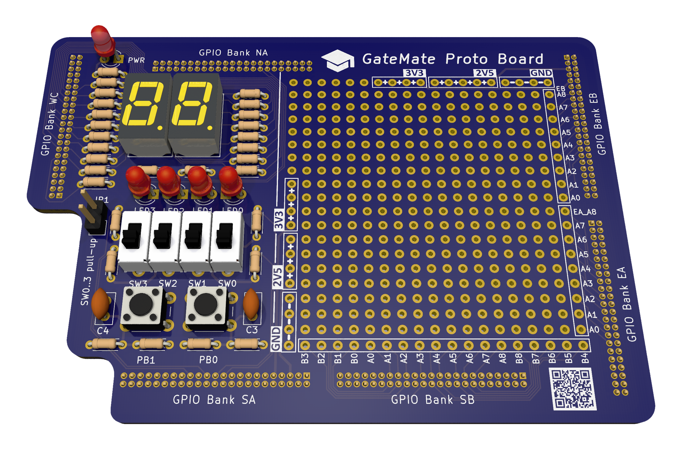
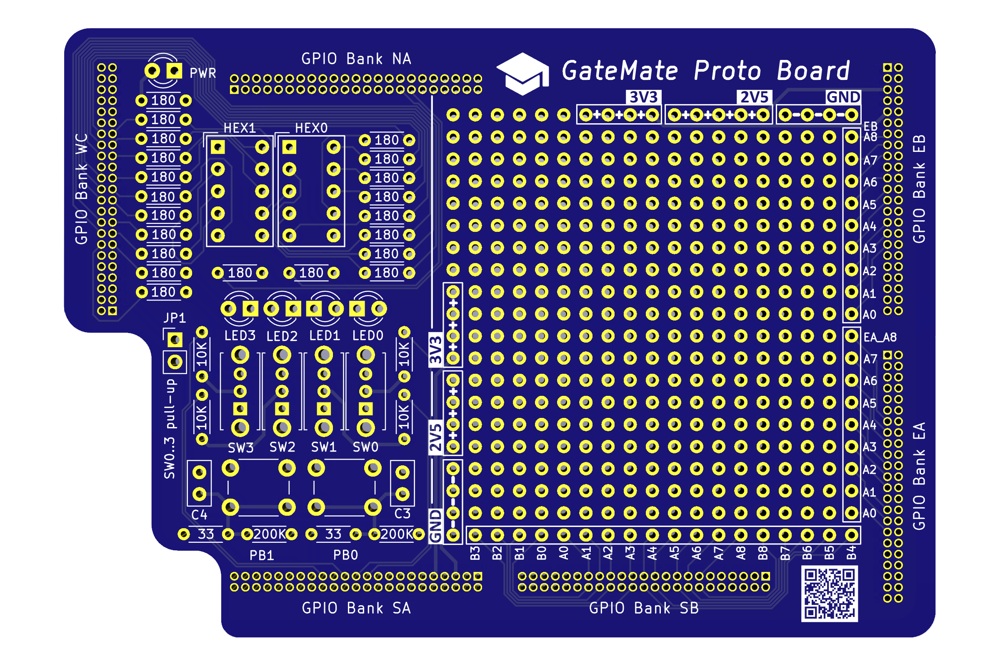

## GM-PROTO-E1

### Description

The gm-proto-e1 board is a application module board for the <a href="https://www.colognechip.com/programmable-logic/gatemate-evaluation-board/">GateMate FPGA evaluation board E1</a>, made by <a href="https://www.colognechip.com/">Cologne Chip</a>. It connects to the evaluation board through the GPIO bank headers, and its main feature is the 20x19 standard 2.54mm pitch prototyping area. 36 FPGA signals from GPIO banks SB, EA and EB are brought in to enable easy experimentation for connecting FPGA board peripherals. In addition, the application board provides a minimal set of data input/output components for basic FPGA interactions, populated via standard through-hole soldering:

- 2x push buttons
- 4x slide switches
- 4x LED
- 2x 7-Segment display modules

### Schematic

### Hardware Versions

The gm-proto-e1 application board has been designed as a 100x70mm double-layer PCB, with precision alignment of the six 46-pin 1.27mm pitch GPIO connectors, verified to fit the GateMate FPGA evaluation board E1 V3.1B.

| Version | Gerber | Schema |
|---------|--------|--------|
| 1.0     |[20220914-gm-proto-e1-gerber.zip](fabfiles/v10/20220914-gm-proto-e1-gerber.zip) | [20220914-gm-proto-e1-schematic.pdf](fabfiles/v10/20220914-gm-proto-e1-schematic.pdf) |

 
 

### Pin Assignments

The board hardware constraints file is located here: [gm-proto-e1.ccf](examples/gm-proto-e1.ccf)

Note: Components are prefixed with "pr" to identify them belonging to the gm-proto-e1 application board.

#### 4x LED output "prled" on IO Bank NA and WC

Name     | Location | Direction | Standard | comment
---------|----------|-----------|----------|---------
prled[0] | IO_NA_A7 | output    | 2.5V     |
prled[1] | IO_NA_A8 | output    | 2.5V     |
prled[2] | IO_WC_B0 | output    | 2.5V     |
prled[3] | IO_WC_A0 | output    | 2.5V     |

#### 2x 7-Segment Digits "prhex0" and "prhex1"

Name      | Location | Direction | Standard | comment
----------|----------|-----------|----------|-----------
prhex0[0] | IO_WC_B8 | output    | 2.5V     | hex0 - DP
prhex0[1] | IO_WC_B7 | output    | 2.5V     | hex0 - A
prhex0[2] | IO_WC_B6 | output    | 2.5V     | hex0 - B
prhex0[3] | IO_WC_B5 | output    | 2.5V     | hex0 - C
prhex0[4] | IO_WC_B4 | output    | 2.5V     | hex0 - D
prhex0[5] | IO_WC_B3 | output    | 2.5V     | hex0 - E
prhex0[6] | IO_WC_B2 | output    | 2.5V     | hex0 - F
prhex0[7] | IO_WC_B1 | output    | 2.5V     | hex0 - G

Name      | Location | Direction | Standard | comment
----------|----------|-----------|----------|--------
prhex1[0] | IO_WC_A8 | output    | 2.5V     | hex1 - DP
prhex1[1] | IO_WC_A7 | output    | 2.5V     | hex1 - A
prhex1[2] | IO_WC_A6 | output    | 2.5V     | hex1 - B
prhex1[3] | IO_WC_A5 | output    | 2.5V     | hex1 - C
prhex1[4] | IO_WC_A4 | output    | 2.5V     | hex1 - D
prhex1[5] | IO_WC_A3 | output    | 2.5V     | hex1 - E
prhex1[6] | IO_WC_A2 | output    | 2.5V     | hex1 - F
prhex1[7] | IO_WC_A1 | output    | 2.5V     | hex1 - G

#### 4x Slide Switch input "prswi" on IO Bank SA

Name     | Location | Direction | Standard | comment
---------|----------|-----------|----------|--------
prswi[0] | IO_SA_A5 | input     | 2.5V     |
prswi[1] | IO_SA_A4 | input     | 2.5V     |
prswi[2] | IO_SA_A3 | input     | 2.5V     |
prswi[3] | IO_SA_A2 | input     | 2.5V     |

#### 2x Push Buttons "prbtn" on IO Bank SA

Name     | Location | Direction | Standard | comment
---------|----------|-----------|----------|--------
prbtn[0] | IO_SA_A1 | input     | 2.5V     |
prbtn[1] | IO_SA_A0 | input     | 2.5V     |

For prototyping, 36 IO signals from GPIO banks SB, EA and EB have been placed into the 2.54mm area border pin rows.

### Example Code

The following code examples demonstrate the board input/output components for quick verification. The code has been tested with the pre-compiled opensource toolchain released through the GateMate support site at <a href="https://www.colognechip.com/mygatemate/">https://www.colognechip.com/mygatemate/</a>

| Language | Folder                   | Description                                                       |
|----------|--------------------------|-------------------------------------------------------------------|
| Verilog  |[blink](examples/blink)   | blinks two LED's in a alternating pattern                         |
| Verilog  |[count](examples/count)   | binary counter displayed on four LED and two 7-Segment digits     |
| Verilog  |[button](examples/button) | push button press changes LED frequency and light move direction  |
| Verilog  |[switch](examples/switch) | each slide switch turns its corresponding LED on or off           |

### Board Pictures

The gm-proto-e1 application board has been designed with KiCad version 6.0.

