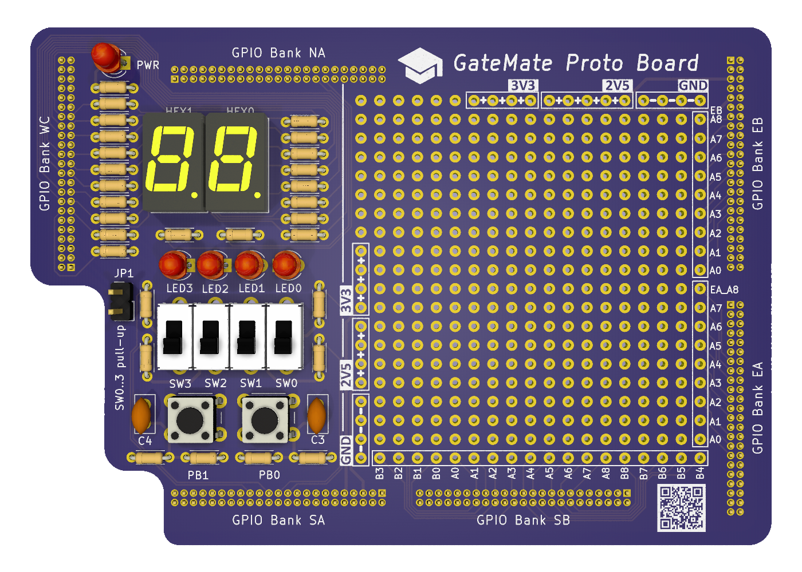
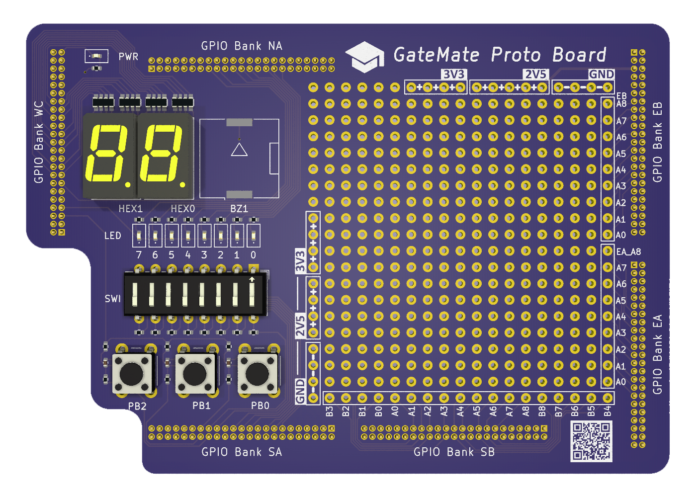
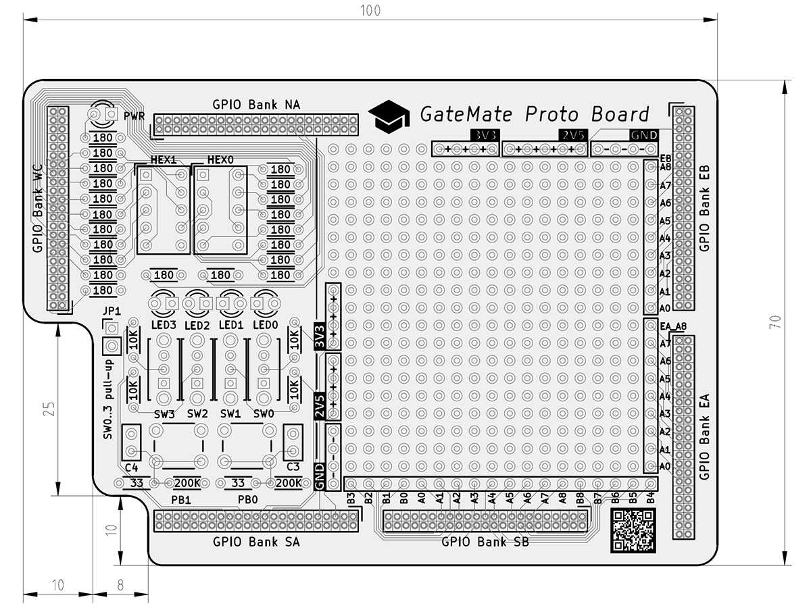
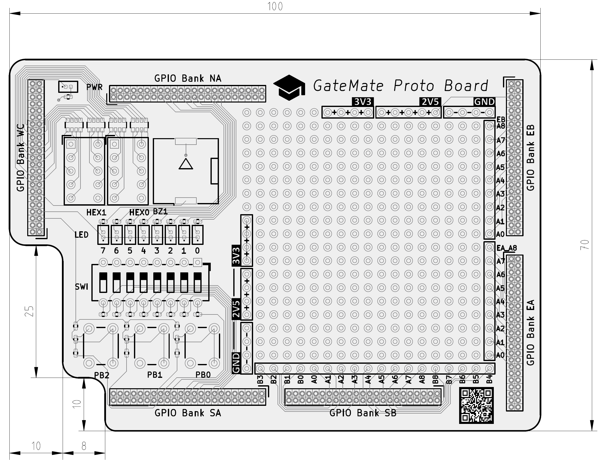
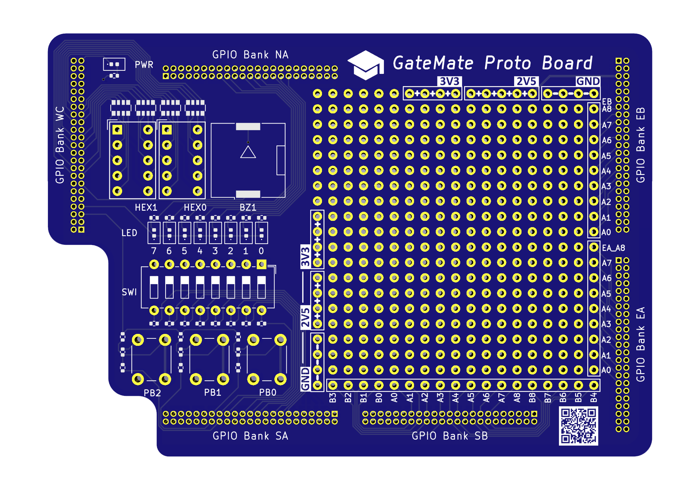

## GM-PROTO-E1

### Description

The gm-proto-e1 board is an application module board for the <a href="https://www.colognechip.com/programmable-logic/gatemate-evaluation-board/">GateMate FPGA evaluation board E1</a>, made by <a href="https://www.colognechip.com/">Cologne Chip</a>. It connects to the evaluation board through the GPIO bank headers, and its main feature is the 20x19 standard 2.54mm pitch prototyping area. 36 FPGA signals from GPIO banks SB, EA and EB are brought in to enable easy experimentation for connecting FPGA board peripherals. In addition, the application board provides a minimal set of data input/output components for basic FPGA interactions. Two variants have been designed: One for through-hole components, one for higher density SMD parts:

- 2x push buttons THT / 3x push buttons SMD
- 4x slide switches THT / 8x DIP switches SMD
- 4x LED THT / 8x LED SMD
- 2x 7-Segment display modules
- Buzzer (SMD only)

### Hardware Versions

The gm-proto-e1 application board has been designed as a 100x70mm double-layer PCB, with precision alignment of the six 46-pin 1.27mm pitch GPIO connectors, verified to fit the GateMate FPGA evaluation board E1 V3.1B. For THT components, great care needs to be taken to cut pins flush during soldering and prevent them from reaching components of the evaluation board below. The 1.27mm pitch GPIO connectors are offered with different distance spacers (2, 2.5 and 5mm), and the standard spacers achieve only 5mm total clearance.

#### Through-hole Design:

| Version | Gerber | Schema |
|---------|--------|--------|
| 1.0     |[20220914-gm-proto-e1-gerber.zip](fabfiles-tht/v10/20220914-gm-proto-e1-gerber.zip) | [20220914-gm-proto-e1-schematic.pdf](fabfiles-tht/v10/20220914-gm-proto-e1-schematic.pdf) |

 
 

#### Surface-Mount Design:

| Version | Gerber | Schema |
|---------|--------|--------|
| 1.0     |[20220923-gm-proto-e1-gerber.zip](fabfiles-smd/v10/20220923-gm-proto-e1-gerber.zip) | [20220923-gm-proto-e1-schematic.pdf](fabfiles-smd/v10/20220923-gm-proto-e1-schematic.pdf) |

 
 

### Pin Assignments

Due to IO differences between THT and SMD board variants, they have different pinouts:

#### Through-hole Design:

- IO pinout assigments file: [pin-assignment-tht.md](pin-assignment-tht.md)
- hardware constraints file: [gm-proto-e1-tht.ccf](examples-tht/gm-proto-e1-tht.ccf)

#### Surface-Mount Design:

- IO pinout assigments file: [pin-assignment-smd.md](pin-assignment-smd.md)
- hardware constraints file: [gm-proto-e1-smd.ccf](examples-smd/gm-proto-e10-smd.ccf)

Note: Components are prefixed with "pr", to identify them belonging to the gm-proto-e1 application board. For prototyping, 36 IO signals from GPIO banks SB, EA and EB have been placed into the 2.54mm area border pin rows.

### Example Code

The following code examples demonstrate the board input/output components for quick verification. The code has been tested with the pre-compiled opensource toolchain released through the GateMate support site at <a href="https://www.colognechip.com/mygatemate/">https://www.colognechip.com/mygatemate/</a>

#### Through-hole Design:

| Language | Folder                       | Description                                                       |
|----------|------------------------------|-------------------------------------------------------------------|
| Verilog  |[blink](examples-tht/blink)   | blinks two LED's in a alternating pattern                         |
| Verilog  |[count](examples-tht/count)   | binary counter displayed on four LED and two 7-Segment digits     |
| Verilog  |[button](examples-tht/button) | push button press changes LED frequency and light move direction  |
| Verilog  |[switch](examples-tht/switch) | each slide switch turns its corresponding LED on or off           |

#### Surface-Mount Design:

| Language | Folder                       | Description                                                       |
|----------|------------------------------|-------------------------------------------------------------------|
| Verilog  |[blink](examples-tht/blink)   | blinks four LED's in a alternating pattern                        |
| Verilog  |[count](examples-tht/count)   | binary counter displayed on eight LED and two 7-Segment digits    |
| Verilog  |[button](examples-tht/button) | push button press changes LED frequency and light move direction  |
| Verilog  |[switch](examples-tht/switch) | each slide switch turns its corresponding LED on or off           |

### Board Pictures

The gm-proto-e1 THT board has been designed with KiCad version 6.0.

